# Azizah Songket

This is a company-profile webpage for Azizah Songket. Azizah Sonket is a family business that is engaged in the manufacturing (production) of Sonket using traditional weaving using dyes that utilize dyes from nature that are environmentally friendly so as to reduce the impact of pollution. This web page utilized a basic HTML, CSS, and a slight of JavaScript. This web page also implemented a responsive CSS to suit every screen size.


> ## Table of Contents
>
> -   [Getting Started](#getting-started)
>
> -   [Setup](#setup)
>
> -   [Documented Development Stages](#development)
>
>     -   [HTML](#html)
>     -   [CSS](#css)
>     -   [JavaScript](#javascript)
>
> -   [Deployment Process](#deployment)

<a id="getting-started"></a>

## Getting Started

Before previewing the web page, you need to install the required files to make the page run as intended:

1. [Belleza Font](https://fonts.google.com/specimen/Belleza)

    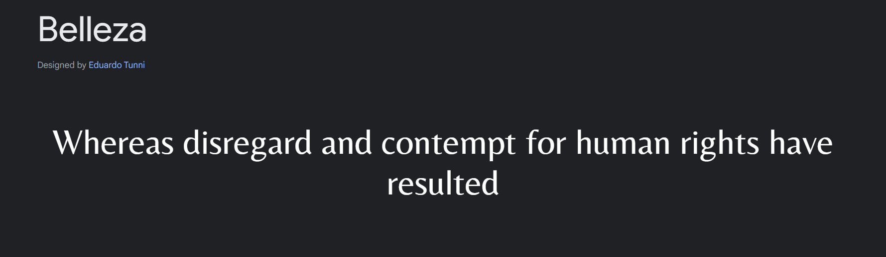

2. [Caudex Font](https://fonts.google.com/specimen/Caudex)

    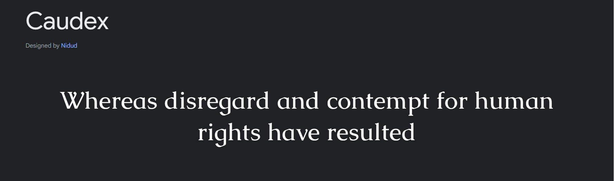

This fonts can be acquired from Google Fonts or by simply cloning this repository.

There are many extension for VS Code that can help you preview this web page. These are the recommended extension that you can install:

1. Live Server

    This extension can be used to preview a webpage by loading the html files and assigning it to a custom port. Live Server also live reload feature that automatically update the page layout by restarting the page every time there is an update on the source repository.

    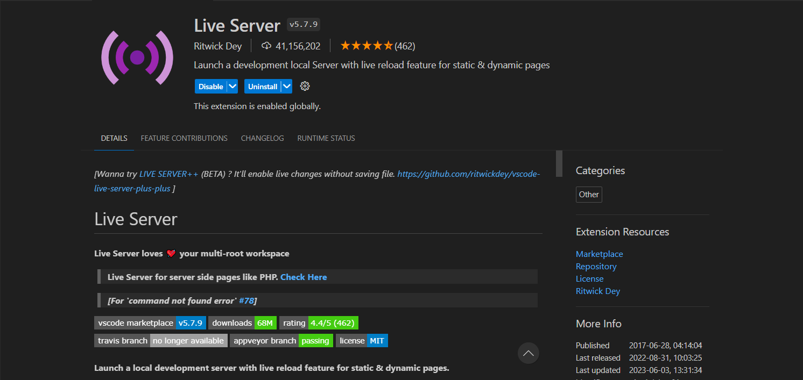

2. Live Preview

    Unlike Live Server, Live Preview runs the html script and displays the preview from VS Code itself. Also, every small change on the html files will be automatically implemented inside the preview.

    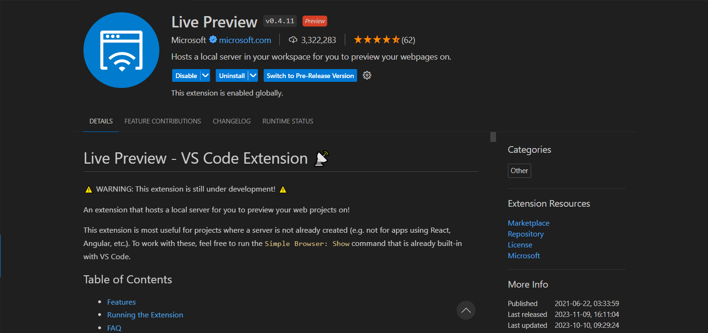

<a id="setup"></a>

## Setup

To set the repo into a development environment, the required steps are:

1. Clone the repo

    ```shell
    git clone https://github.com/Abk1708/milestone-1-Abk1708.git
    ```

2. Navigate into the project directory by using git bash

    ```shell
    cd milestone-1-Abk1708
    ```

3. Access the index file with VS Code

    ```shell
    code index.html
    ```

<a id="development"></a>

## Documented Development Stage

This web page are developed purely on HTML, CSS, and Javascript. any external dependency comes in form of fonts and image files.

<a id="html"></a>

-   HTML

    HTML file is used as a framework for your web page display and used to structure your pages. This web page is structured using html and arranged using a semantic elements such as `<nav>`, `<header>`, , `<main>`, `<section>`, `<footer>`, and `<form>`.

    -   Navigation

        The navigation bar or the Nav bar is located topside of the page. It contains the logo, navigation links what switch into a hamburger menu when accessed on a mobile device, a search button, and a switch for dark-mode.

    -   Header

        The header is the first section to be seen when accessing the page. It contains a `div` that enclose `h1`, and `p` elements and a `div` with a class `.slides` that contains an array of images for a slideshow.

        

        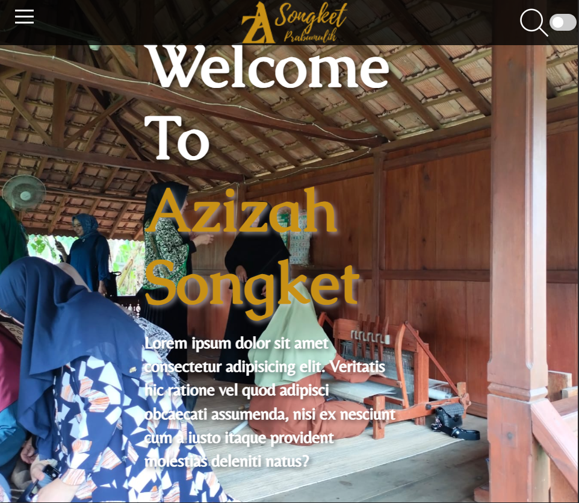

    -   Main

        The Main element is located below the `header` section and consist of five elements.

        -   About

            This first section contain a line up of cards that created using a `div` element. It is also displayed in a `grid`.

            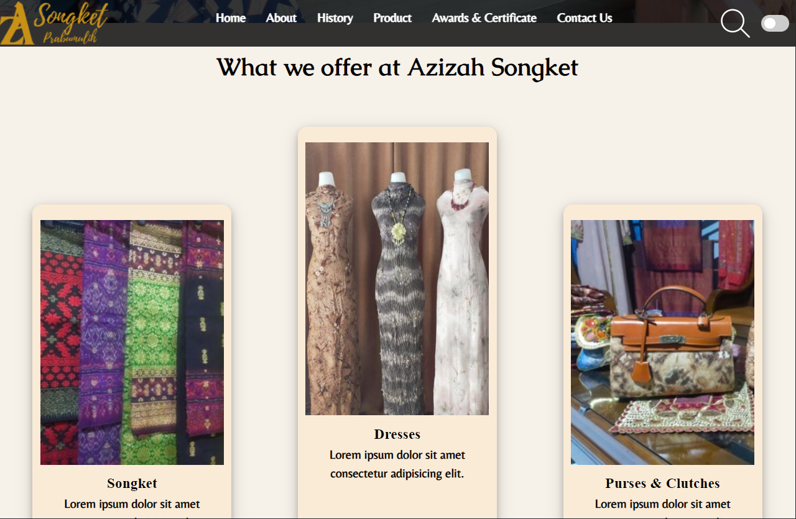

        -   History

            This Second section contain an `iframe`, `h2` and a `p` elements enclosed inside a `article` element.

            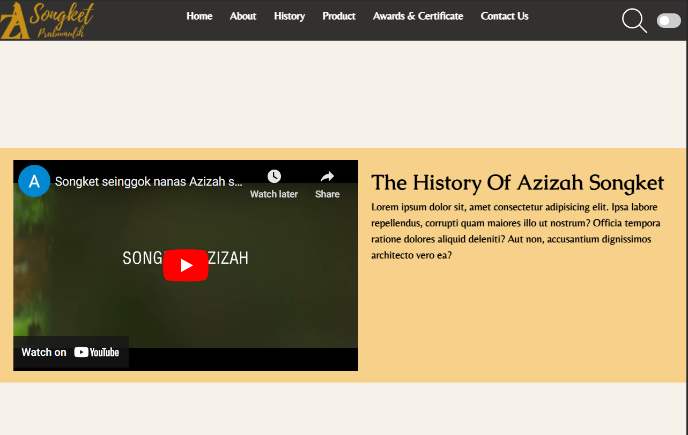

        -   Product

            This Third section contain an asymmetrical grid of image that are contained inside a `div` element with a class `.grid-container`.

            

        -   Awards and Certificates

            This Fourth section contain a lineup of cards containing a `img` and `p` elements structured with a grid display

            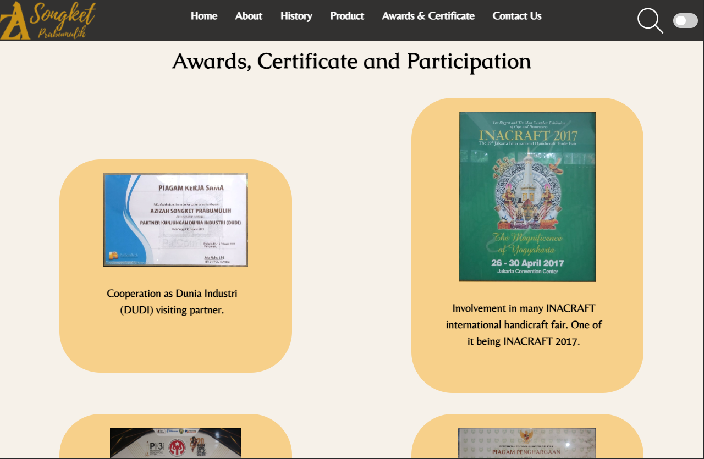

        -   Contact Us

            This Fifth and last main section contain an `iframe` and a `form` element that enclose a `div` elements that contain an `svg`, `input`, and a `button` elements.

    -   Footer

    The footer element located deep down the page and contain an `svg` with a link on it, a navigation links, and a single `p` element.

    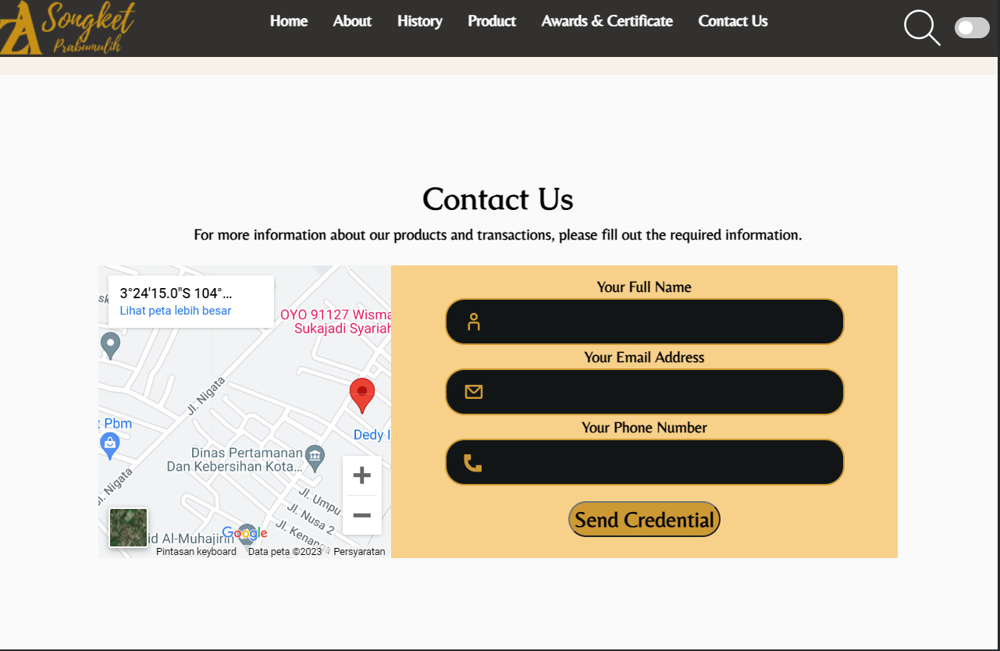

<a id="css"></a>

-   CSS

    All the styling, animation for the slideshow, and transition on the links was developed using CSS.

    

<a id="javascript"></a>

-   JavaScript

    The script that were used for this page is mainly only for the hamburger button, dark mode button, and form validation.

    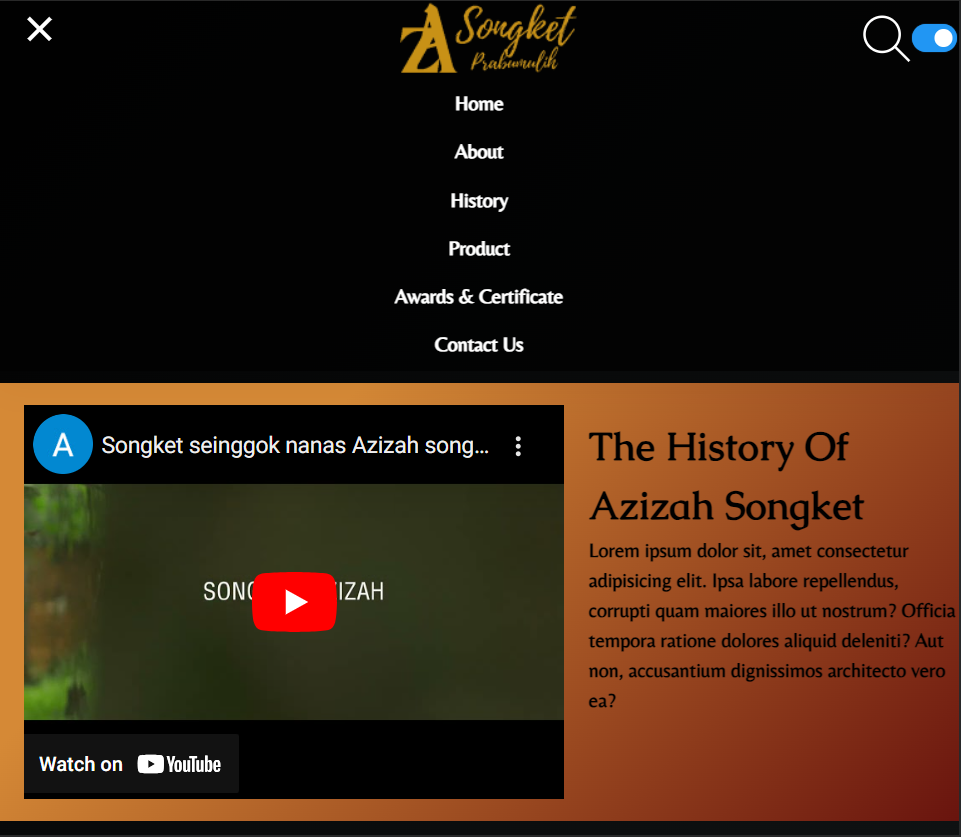

<a id="deployment-process"></a>

## Deployment Process

This web page is deployed using Vercel. Here is the proccess of deploying the web page and assigning it into a custom domain.

1. First of, go to the setting tab and access the domain section. from there input your custom domain inside the domain form.

    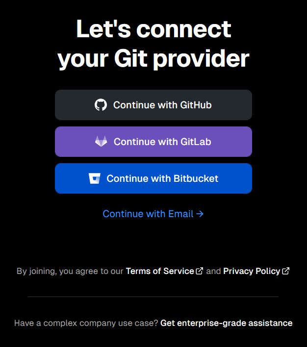

2. go to [Vercel](https://vercel.com/) and log in using your Git Hub account to sync all your repo into vercel.

    

3. After logging in your account, pick one of your repo you want to deploy.

    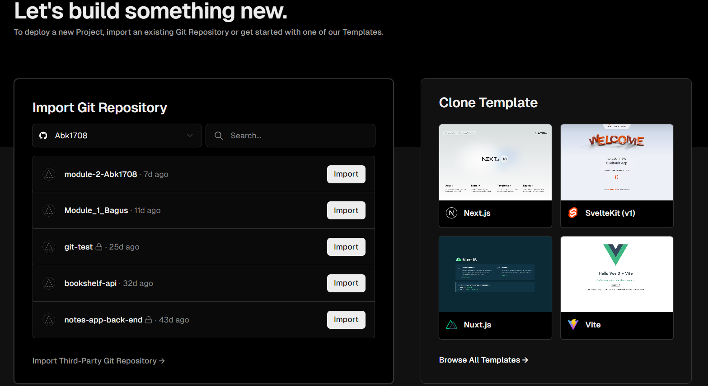

4. After picking which repo you want to deploy, configure which framework you used and where are the root folder located.

    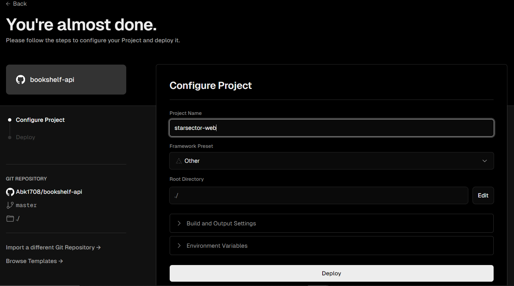

5. Wait for Vercel to finish building up the web page. After it finished, your web page has been deployed and ready to be accessed.

    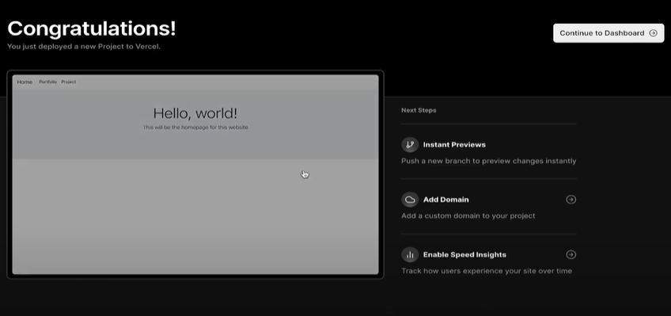

After we've successfully deploy our web page, make sure to link it with a custom domain. here is the step to link a costom domain into our deployed web page.

1. First, First of, go to the setting tab and access the domain section. from there input your custom domain inside the domain form. After that, Vercel informs you that you need to input a specific data inside your DNS provider. from here we need a custom domain and DNS provider.

    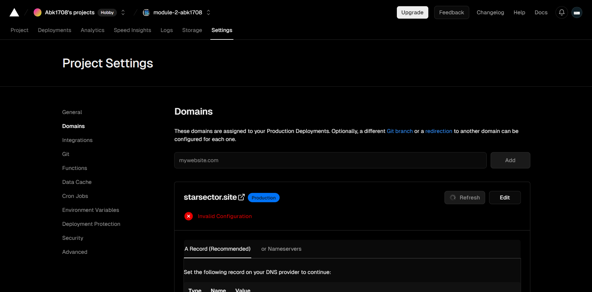

2. For this occasion we'll be using [Niagahoster](https://vercel.com/) for our domain provider

    

3. In this section, it is assumed that you have purchased a custom domain from Niagahoster. From the home page, access the domain menu and click the DNS Section.

    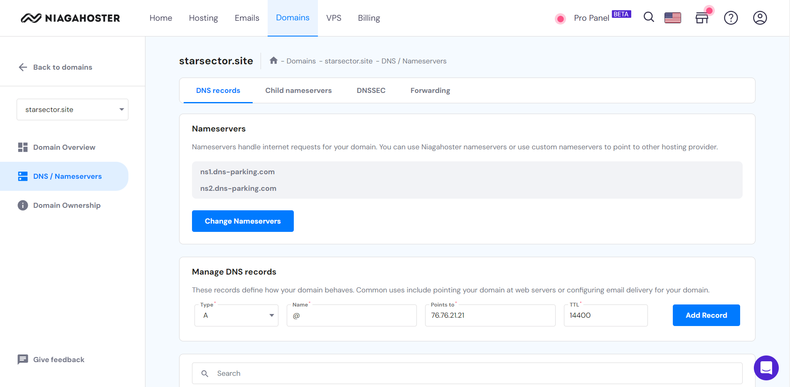

4. Input all the data from vercel into the the Manage DNS Record forms and press "Add Record".

    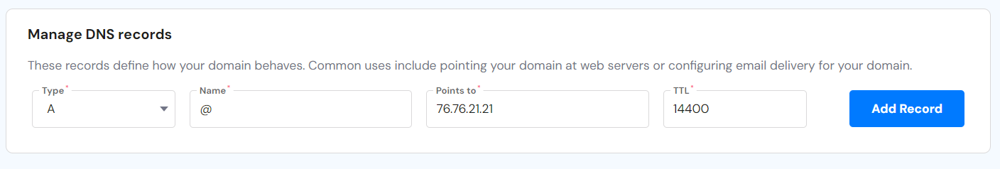

5. After that, your deployed web page will be connected to your new custom domain and ready to accessed using that domain.

    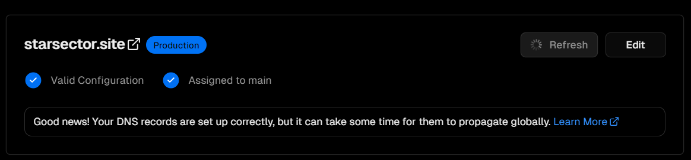
